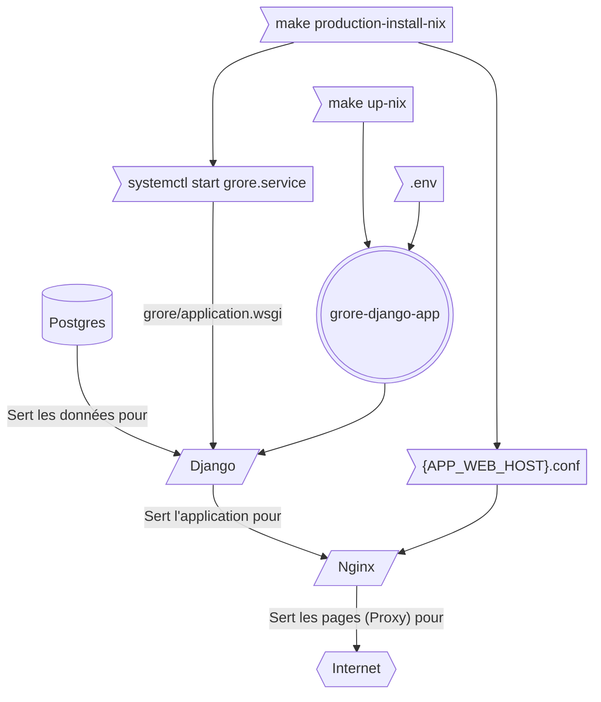

# GRORE

[grore-images.com](https://www.grore-images.com)

Hébergé par [Hetzner](https://www.hetzner.com)

## Configuration

L'ensemble de la configuration se trouve dans le fichier .env. Pour créer ce fichier, 

`cp scripts/sample.env .env`

Il y a des exemples de fichier de confugration dans les dossier  ̀scripts/*.env`.

**Ne pas mettre aucune valeur entre guillements (") ni simple quotes (')**   
Le Makefile utilise ce fichier .env et a une habitude de les reprendre de manière littérale.

Voici les variables de configuration :

| Paramètre | Explication / Exemple|
| --- | --- | 
| APP_DJANGO_ROOT |  Le dossier depuis dans lequel on trouve `manage.py`  **démarre avec "/" et termine sans "/"**. ${PWD} est habituellement le dossier courant. |
|  |  ${PWD}  |
| APP_CACHE_ROOT |  Le dossier pour des fichiers volatiles  **démarre avec "/" et termine sans "/"**. ${PWD} est habituellement le dossier courant. |
|  |  ${APP_DJANGO_ROOT}/.cache  |
| APP_DJANGO_USER_USER | Pour le service systemd  |
|  |  django  |
| APP_DJANGO_USER_GROUP |  Pour le service systemd |
|  |  www-data  |
| APP_WEB_HOST | Partie externe après "://" et avant "/" peut être directement Django. Peut être le même que DJANGO_HOST. Utilisé par NGINX aussi. |
|  |  grore-images.com ou 127.0.0.1 ou localhost |
| APP_WEB_PORT | Le port visible à l'extérieur (identique que intérieur si absence proxy)  |
|  |  443 ou 80 ou 8000  |
| APP_WEB_PROTO | Partie externe http peut être directement Django  |
|  |  https ou http |
| APP_WEB_ROOT | Dossier pour la racine du proxy web sous lequel on trouve habituellement media et staticfiles **démarre avec "/" et termine sans "/"**  |
|  |  /var/www/html/grore ou ${APP_DJANGO_ROOT}/cache/www |
| DB_DATABASE | Le nom de la base de données (ou le fichier chemin absolu si SQLite3, mais attention, le dossier doit exister)  |
|  |  grore ou ${APP_DJANGO_ROOT}/cache/db.sqlite3 |
| DB_ENGINE |  Le type de base de données |
|  |  django.db.backends.postgresql (ou .sqlite3)  |
| DB_HOST |   |
|  |  localhost  |
| DB_PASSWORD |   |
|  |  CHANGE_ME  |
| DB_PORT |   |
|  |  5432  |
| DB_USER |   |
|  |  grore  |
| DEBUG |  Pour DJANGO |
|  |  false  |
| DJANGO_ALLOWED_HOSTS |  La partie après "://" et avant ":" et avant "/", pour avoir permission d'y accéder. Pas besoin d'indiquer le port. |
|  |  localhost, 127.0.0.1, grore-images.com, ${APP_WEB_HOST}  |
| DJANGO_HOST |  La partie après "://" et avant "/" où le serveur Django ou Gunicorn écoute principalement  |
|  |  localhost ou  ou ${APP_WEB_HOST}  |
| DJANGO_LANGUAGE_CODE | La langue (par défaut ?) du site  |
|  |  en ou fr  |
| DJANGO_MEDIA_ROOT |  Ce dossier est créé avec `make init-nix`. **démarre avec "/" et termine sans "/"** |
|  |  /var/www/html/grore/media  |
| DJANGO_MEDIA_URL | **ni "/" avant ni "/" après**  |
|  |  media  |
| DJANGO_PORT | pour gunicorn ou django  |
|  |  8000 ou ${APP_WEB_PORT} |
| DJANGO_PROTO | https ou http pour gunicorn ou django  |
|  |  http  |
| DJANGO_SETTINGS_MODULE | N'est guère utilisé actuellement en interne mais pris automatiquement par DJANGO |
|  |  grore.settings  |
| DJANGO_STATIC_ROOT | Ce dossier est créé avec `make init-nix`. **démarre avec "/" et termine sans "/"**. |
|  | ${APP_DJANGO_ROOT}/cache/www/staticfiles ou /var/www/html/grore/staticfiles  |
| DJANGO_STATIC_URL |  **ni "/" avant ni "/" après**  |
|  |  static  |
| DOCKER_USER | User known to docker |
| | grore |
| DOCKER_GROUP | Group known to docker |
| | grore |
| DOCKER_UID | UID known to docker from `id -u` |
| | 1000 |
| DOCKER_GID | GID known to docker from `id -g` |
| | 1000 |
| ENVIRONEMENT |  Est-ce que nous utilisons le docker-compose ?  True ou False |
|  |  False  |
| NGINX_DOMAINS |  Configuration de proxy NGINX partie après "://" et avant premier / |
|  |  www.grore-images.com grore-images.com et éventuellement ${APP_WEB_HOST} / ${DJANGO_HOST} |
| NGINX_MAX_SIZE | Taille max des fichiers  |
|  |  500M  |
| SECRET_KEY |  Pour Django/ Gunicorn |
|  |  ./venv/bin/python manage.py shell -c "from django.core.management.utils import get_random_secret_key; print(get_random_secret_key())"  |

Voici un diagramme de l'architecture en production.

## Commandes Makefile

Toute commande `make` peut être post-fixé `-nix` pour exécuter la commande dans l'environnement nix spécifié par `scripts/default.nix`.

Voici les commandes principales

| command make | explication |
| --- | --- |
| `make up` / `make up-nix` | Met à jour et initialize l'environnement actuel  | 
| `make default-pages` / `make default-pages-nix` | Ajout des pages par défault  | 
| `make runserver` / `make runserver-nix` |  Tourne un serveur de développement (dev sans avoir mis à jour) | 
| `make production-prepare` / `make production-prepare-nix` | Crée les fichiers de configuration dans ./scripts/production/output/ (nginx et service systemd)  | 
| `make production-install` / `make production-install-nix` |  Fait toutes les opérations sur NGINX et SYSTEMD en tant que SUDO | 
| `make restart` / `make restart-nix`  | Met à jour et redémarre le serveur en production  | 

Voici les commandes intermédiaires

| command make | explication |
| --- | --- |
| `make init` / `make init-nix` | Etablit l'environnement de base Python (ne fait pas `source ./venv/bin/activate`)  | 
| `make nginxconf` / `make nginxconf-nix` |  Crée le fichier de config scripts/production/output/webser.nginx | 
| `make service` / `make service-nix` |  Crée le fichier de config scripts/production/output/grore.service | 
| `make sys-install-nix` ou `make sys-install-nix-mac` | Installe Nix sur votre propre ordinateur linux (y compris wsl) ou mac |

Voici les commandes en travaux

| command make | explication |
| --- | --- |
| `make docker-compose-up` / `make docker-compose-up-nix` |   | 
| `make docker-nginx` / `make docker-nginx-nix` |   | 
| `make docker-postgres` / `make docker-postgres-nix` |   | 
| `make test-uploaded-images` / `make test-uploaded-images-nix` |   | 

## Using docker compose in development

Checkout a great tutorial for django and docker in development and production:

https://testdriven.io/blog/dockerizing-django-with-postgres-gunicorn-and-nginx/

`docker compose up -- build`

## GITHUB ACTIONS

Try for continous integration underway.

See 

https://github.com/chris2fr/messhouse/wiki

for intgrating continuous deployment secret.

The following command deploys from github:SVarbitskya/grore-django-app branch production

ssh django@grore-images.com '/home/django/up.sh'

Assuming that   
django@grore-images.com:/home/django/.ssh/authorized_keys  
has the id_rsa.pub equivalent to the id_rsa used by the calling agent.
`ssh-keygen -t rsa`  
to create the id_rsa and id_rsa.pub files  in .ssh  
`cat ~/.ssh/id_rsa.pub`   
to share the public key.

Also used by .github/workflows/up.yml continuous deployment script

## NIXPKGS

We use NIXPKGS and not NIXOS. To install Nixpkgs (multi-user daemon) :

https://nixos.org/download/#download-nix

for me this is 

`sh <(curl -L https://nixos.org/nix/install) --daemon`

Restart the terminal 

in the same folder as `nix.shell`, run 

`nix-shell`

then a typical python virtual environment

`python -m venv venv`

activate the venv

`source venv/bin/activate`

create and edit the .env configuration file:

`cp scripts/sample.env .env`  
puis modifier .env selon les besoins

start the database from docker (if dev)  
check to see if docker is running :  
`systemctl status docker`  
and then start the posgresql database (if dev)
`docker compose up -d`  
which is set to port 15432
or provision a working database if production

Copy the settings    
`cp grore/settings.py grore/settings_local.py`  
and modify parameters as required 
