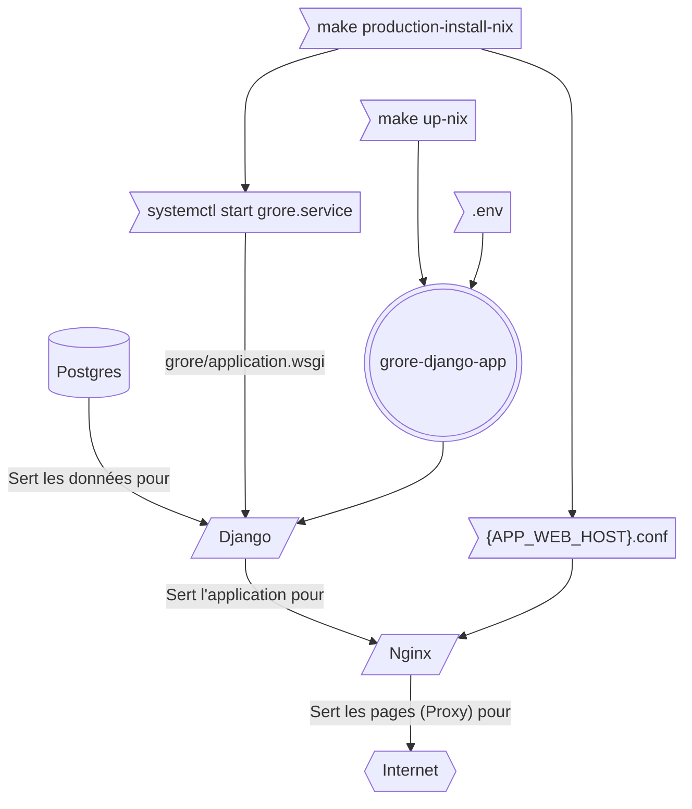

# Architechture

Voici un diagramme de l'architecture en production.

```mermaid
graph TB

Django[/Django/]
Nginx[/Nginx/]
Postgres[(Postgres)]
make-production-install>make production-install-nix]
make-up>make up-nix]
GroreNginxConf>"{APP_WEB_HOST}.conf"]
grore.service>systemctl start grore.service]
internet{{Internet}}
.env>.env]
grore-django-app(((grore-django-app)))

Postgres -- "Sert les données pour" --> Django -- "Sert l'application pour" --> Nginx -- "Sert les pages (Proxy) pour" --> internet
grore.service -- "grore/application.wsgi" ---> Django
make-production-install ---> grore.service
make-production-install ---> GroreNginxConf --> Nginx
make-up ---> grore-django-app --> Django
.env --> grore-django-app
```