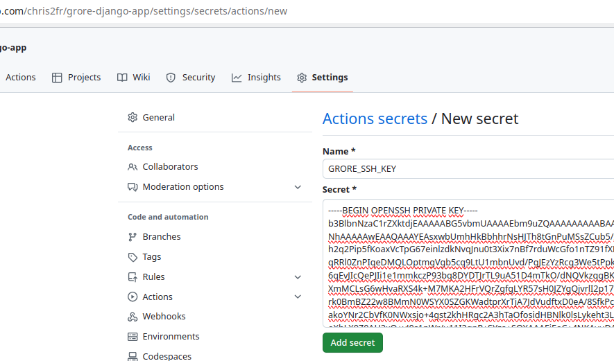

# Setup Continuous Integration

Created .github/worflows/up.yml

Needs secret GRORE_SSH_KEY

ssh-keygen -t rsa

use grore_ssh instead of default name

cat grore_ssh # The private key and into the repository secret

Put the grore_ssh.pub in the authorized_keys on grore-images.com

cat grore_ssh.pub

And on the distant machine

echo "ssh-rsa AAAAB3NzaC1yc2EAAAADAQABAAABgQCzHBtSaEeQFuGGs2wclOHy0ac+4xKxkK5vn/HUbCUvk/SaRVUhsWKHarY+Knl8qhrFVxOkbrt6KeXN2Q2+ome7S3deLHucF/ut25ZwZ+jWdNn3V9coyuzpThvjapFGXRmc8ip4MxAs6m2aBWBvlyr0u1TWZudS938+AkTNjNFyDdZ7m0+mSNk5q9So5AVDx1TqoS8khxB48kiLV7WaaRzM/3durwNgNMmtMv24DnUPiZOQ7901BWTOqAEpefu7ZAJyIf7DdeYwIuwbrAe9pFdLiT4zswoDYcWtVCtmB+AthHnuwfQlliBCO+uUjanXsWBrKVHCL2crHU+uTQGYFnbbDwEyY3RZJhfRJkYpZp22mtetOMDsl1W51+3EPR4D/xJ+Q9x/3yWyXjQ7COrSxqShg2vYJtV8rQ1bGyOj7iCy3aSEdGBzYDeFNo5+iyJ0cE2WTSWwvKR6G3cuiGUMjp8rfkqheEtf1nQAfbFD68nSzWlav+7XUjaqk/5JjNr5I5c=" >> /home/django/.ssh/authorized_keys

